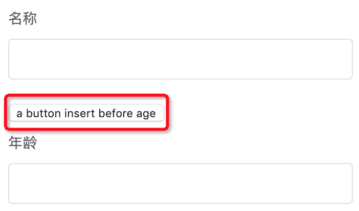

# el-form-renderer

[](https://travis-ci.com/FEMessage/el-form-renderer)
[](https://www.npmjs.com/package/@femessage/el-form-renderer)
[](https://www.npmjs.com/package/@femessage/el-form-renderer)
[](https://github.com/FEMessage/el-form-renderer/blob/master/LICENSE)
[](https://github.com/FEMessage/el-form-renderer/pulls)
[](https://github-tools.github.io/github-release-notes/)


## Table of Contents

* [el-form-renderer](#el-form-renderer)
  * [Table of Contents](#table-of-contents)
  * [Introduction](#introduction)
  * [Feature](#feature)
    * [fork 的版本](#fork-的版本)
      * [v.1.3.0](#v130)
      * [v.1.2.0](#v120)
      * [v1.1.0](#v110)
    * [原版本](#原版本)
  * [Demo](#demo)
  * [Quick start](#quick-start)
  * [Props](#props)
    * [属性](#属性)
    * [content](#content)
    * [特殊属性说明](#特殊属性说明)
      * [$type: 'group'](#type-group)
      * [component](#component)
  * [Methods](#methods)
  * [Slot](#slot)
  * [Redev](#redev)
  * [License](#license)
  * [Contributors](#contributors)

## Introduction

基于 [element-ui](https://github.com/ElemeFE/element) 封装的**表单渲染器**，在开源项目[**el-form-renderer**](https://github.com/leezng/el-form-renderer)的基础上二次开发而来

**WHAT**

`el-form-renderer`是基于 [element-ui](https://github.com/ElemeFE/element) 封装的**表单渲染器**，但不局限于 [element-ui](https://github.com/ElemeFE/element) 组件。在完整继承了 element 的 form 表单属性的基础上进行了简单扩展，一些非表单组件或者封装的自定义组件，如图片上传、富文本等也可进行整合，从而用户能够通过使用一段预设的数据渲染出一个完整的表单。

**WHY**

日常需要面对大量表单类的场景，通常这些表单结构相似，逻辑存在重复，由各种简单的原子表单组件构建而成。el-form-renderer 没有复杂的逻辑，只需进行简单配置 JSON 的方式就可实现常用表单功能，节省写代码的时间和精力，减少许多重复冗余的代码。

## Feature

### fork 的版本

#### v.1.3.0

* content 添加 `inputFormat`、`outputFormat`、`trim`，对组件输入输出值处理

#### v.1.2.0

* 添加 setOptions 方法，支持动态改变 options

#### v1.1.0

* 支持局部注册组件
* 支持使用自定义组件
* 批量更新数据 updateForm

### 原版本

* 完整继承了 element 的 form 表单属性
* 只需进行简单的配置，即可实现常用表单功能

**[⬆ Back to Top](#table-of-contents)**

## Demo

* [doc and online demo](https://femessage.github.io/el-form-renderer/)

**[⬆ Back to Top](#table-of-contents)**

## Quick start

```html
<!-- Step1 确认你已经正确安装并使用了 element-ui -->

<!-- Step2 安装 -->
<!-- yarn add @femessage/el-form-renderer -->

<!-- Step3 在需要使用该渲染器的 .vue 文件中 -->
<template>
  <el-form-renderer :content="content"></el-form-renderer>
</template>

<script>
import ElFormRenderer from '@femessage/el-form-renderer'

export default {
  components: {
    ElFormRenderer
  },
  data () {
    return {
      content: []
    }
  }
}
</script>
```

**[⬆ Back to Top](#table-of-contents)**

## Props

### 属性

* 支持 [el-form](http://element.eleme.io/#/zh-CN/component/form) 上的所有属性。
* `disabled` [Boolean] 设置为 `true` 可禁用所有原子表单。`element-ui` 版本如果在 `2.1.0` 以下本渲染器依旧兼容。
* `content` [ObjectArray] 定义表单的内容，每一个 `Object` 代表一个原子表单(`el-input, el-select, ...`)，一切 `el-form-item` 上的属性都可在此声明，而对于 `el-input` 等之上的属性在 `$el` 属性上进行声明，该 `Object` 上还存在其他属性，例如: `$id`,`$type/component`, `$default`,`$enableWhen`[可选], `$options`[可选], `$attrs`[可选]

### content

每一个原子表单`Object`可配置如下内容：

* `$id` 每一个原子都存在 id，用于存储该原子的值，不能重复
* `$type` 类型，element 提供的所有表单类型，即 el-xxx
* `component` 用于处理自定义组件，局部引用的组件
* `$default` 默认值
* `$enableWhen` [Object] 可选属性，用于表单对应的为指定值时显示
* `$options` 具有选择功能的原子表单可用此定义可选项，例如: `select`, `radio-group`, `radio-button`, `checkbox-group`, `checkbox-button`
* `$attrs` 可选, 写法与 Vue 的 Render 函数规范保持一致
* `$el` 用于定义具体原子表单的属性，比如常见的`placeholder`
* `label` 对应 `el-form-item`上的`label`属性，表单域标签
* `trim`布尔值，如果为`true`，则对该字符串执行`trim()`方法。默认为`true`
* `inputFormat`用于处理输入值，辅助`updateForm`进行对应值更新，参数为`updateForm`传入的对象
* `outputFormat`用于处理输出值，参数为对应组件返回值
* `rules` 对应 `el-form-item`上的`rules`属性， 用于验证
* `atChange`: `(id, value) => void` 当前表单值更新时触发, 入参分别为当前修改的`id:$id`和`值:value`

content example：

```js
;[
  {
    $id: 'form1', // 每一个原子都存在id，用于存储该原子的值，注意不能重复
    $type: 'input', // 类型，element 提供的所有表单类型，即 el-xxx
    $enableWhen: {form2: 'beijing'}, // 可选属性，表示当 form2 的值为 beijing 时显示
    $attrs: {'data-name': 'form1'}, // 可选, 写法与 Vue 的 Render 函数规范保持一致
    label: '输入框', // el-form-item上的属性
    $default: '这是默认值',
    rules: [{required: true, message: '请输入活动名称', trigger: 'blur'}] // el-form-item上的属性
  },
  {
    $id: 'form2',
    $type: 'select',

    label: '选择框',
    // $el 上用于定义具体原子表单(此处为el-select)的属性
    $el: {
      placeholder: '请选择内容'
    },
    // $options 具有选择功能的原子表单可用此定义可选项，例如: select, radio-group, radio-button, checkbox-group, checkbox-button
    $options: [
      {
        label: '区域一',
        value: 'shanghai'
      },
      {
        label: '区域二',
        value: 'beijing'
      }
    ],
    atChange: (id, value) => {
      // ...
    }
  }
]
```

### 特殊属性说明

为满足一些特殊场景，特单独说明如下属性：

#### $type: 'group'

`$type` 属性有一个特殊的可选值: `group`，可用于创建更为复杂的表单数据类型:

```js
// 该例将获得对象数据结构:
// group1: {
//   input1: '',
//   input2: ''
// }
{
  $id: "group1", // 遵循同一层级的ID不重复的原则，实质上相当于对象的键
  $type: "group",
  label: "这是一个对象数据",
  $items: [{
    $id: "input1",
    $type: "input",
    label: "输入框1",
    $default: "这是默认值"
  }, {
    $id: "input2",
    $type: "input",
    label: "输入框2",
    $default: "这是默认值",
  }]
}
```

#### component

为了满足局部注册组件和使用自定义组件的需求，我们在原有组件的基础上拓展了原子表单的`component`属性，用于使用局部注册和自定义的组件。

注意： `component`适用于渲染局部注册组件和自定义组件，而`$type`适用于带`el-`前缀的全局组件

```js
{
  $id: 'avatar',
  component: UploadToAli,  // UploadToAli 为非 ElementUI 组件，从外部引入
  label: '头像'
}
```

**[⬆ Back to Top](#table-of-contents)**

## Methods

* 支持 [el-form](http://element.eleme.io/#/zh-CN/component/form) 上的所有方法。

* 其他方法:

| 方法名       | 描述                                                                    | 参数                           |
| ------------ | ----------------------------------------------------------------------- | ------------------------------ |
| getFormValue | 获取当前表单的值                                                        | -                              |
| updateForm   | 手动批量更新表单的值                                                    | ({$id1: value1, $id2: value2}) |
| setOptions   | 动态设置新的 options。第一个参数为要设置的$id，第二个参数为新的 options | ($id, options)                 |

**[⬆ Back to Top](#table-of-contents)**

## Slot

* 支持通过默认 `slot` 往表单尾部插入自定义 `VNode`。
* 支持具名插槽 `$id:form-item的id` 于 `$id` 前插入任意内容。

具名插槽示例

```html
<template>
  <el-form-renderer :content="content">
    <button slot="$id:age">a button insert before age</button>
  </el-form-renderer>
</template>

<script>
export default {
  data() {
    return {
      content: [
        {
          $id: 'name',
          label: '名称',
          $type: 'input'
        },
        {
          $id: 'age',
          label: '年龄',
          $type: 'input'
        }
      ]
    }
  }
}
</script>
```

展示效果:



**[⬆ Back to Top](#table-of-contents)**

## Redev

install dependency

```sh
yarn

yarn add element-ui -P
```

run dev server

```sh
yarn dev
```

publish to npm

```sh
npm version

yarn dist

cd dist

npm publish --access public
```

**[⬆ Back to Top](#table-of-contents)**

## License

[MIT](./LICENSE)

**[⬆ Back to Top](#table-of-contents)**

## Contributors

Thanks goes to these wonderful people ([emoji key](https://allcontributors.org/docs/en/emoji-key)):

<!-- ALL-CONTRIBUTORS-LIST:START - Do not remove or modify this section -->

<!-- prettier-ignore -->
<table><tr><td align="center"><a href="https://github.com/Alvin-Liu"><br /><sub><b>Alvin</b></sub></a><br /><a href="https://github.com/FEMessage/el-form-renderer/commits?author=Alvin-Liu" title="Code">💻</a> <a href="#review-Alvin-Liu" title="Reviewed Pull Requests">👀</a> <a href="https://github.com/FEMessage/el-form-renderer/issues?q=author%3AAlvin-Liu" title="Bug reports">🐛</a> <a href="#blog-Alvin-Liu" title="Blogposts">📝</a> <a href="#ideas-Alvin-Liu" title="Ideas, Planning, & Feedback">🤔</a></td><td align="center"><a href="http://levy.work"><br /><sub><b>levy</b></sub></a><br /><a href="#review-levy9527" title="Reviewed Pull Requests">👀</a> <a href="#infra-levy9527" title="Infrastructure (Hosting, Build-Tools, etc)">🚇</a> <a href="#ideas-levy9527" title="Ideas, Planning, & Feedback">🤔</a></td><td align="center"><a href="https://evila.me"><br /><sub><b>EVILLT</b></sub></a><br /><a href="https://github.com/FEMessage/el-form-renderer/commits?author=evillt" title="Code">💻</a> <a href="https://github.com/FEMessage/el-form-renderer/issues?q=author%3Aevillt" title="Bug reports">🐛</a> <a href="#blog-evillt" title="Blogposts">📝</a> <a href="#ideas-evillt" title="Ideas, Planning, & Feedback">🤔</a></td></tr></table>

<!-- ALL-CONTRIBUTORS-LIST:END -->

This project follows the [all-contributors](https://github.com/all-contributors/all-contributors) specification. Contributions of any kind welcome!
