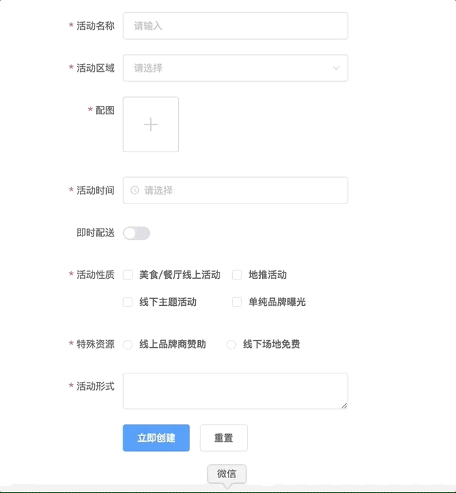

# el-form-renderer

[](https://travis-ci.com/FEMessage/el-form-renderer)
[](https://www.npmjs.com/package/@femessage/el-form-renderer)
[](https://www.npmjs.com/package/@femessage/el-form-renderer)
[](https://github.com/FEMessage/el-form-renderer/blob/master/LICENSE)
[](https://github.com/FEMessage/el-form-renderer/pulls)
[](https://github-tools.github.io/github-release-notes/)



## Table of Contents <!-- omit in toc -->

* [Introduction](#introduction)
* [Feature](#feature)
* [Demo](#demo)
* [Quick start](#quick-start)
* [License](#license)
* [Contributors](#contributors)

## Introduction

基于 [element-ui](https://github.com/ElemeFE/element) 封装的**表单渲染器**，在开源项目[**el-form-renderer**](https://github.com/leezng/el-form-renderer)的基础上二次开发而来

**WHAT**

`el-form-renderer`是基于 [element-ui](https://github.com/ElemeFE/element) 封装的**表单渲染器**，但不局限于 [element-ui](https://github.com/ElemeFE/element) 组件。在完整继承了 element 的 form 表单属性的基础上进行了简单扩展，一些非表单组件或者封装的自定义组件，如图片上传、富文本等也可进行整合，从而用户能够通过使用一段预设的数据渲染出一个完整的表单。

**WHY**

日常需要面对大量表单类的场景，通常这些表单结构相似，逻辑存在重复，由各种简单的原子表单组件构建而成。el-form-renderer 没有复杂的逻辑，只需进行简单配置 JSON 的方式就可实现常用表单功能，节省写代码的时间和精力，减少许多重复冗余的代码。

## Feature

* 只需进行简单的配置，即可实现常用表单功能
* 支持使用自定义组件
* 批量更新数据 updateForm
* 支持 setOptions 方法，支持动态改变 select 的 options
* content 支持 `inputFormat`、`outputFormat`、`trim`，对组件输入输出值处理

**[⬆ Back to Top](#table-of-contents)**

## Demo

* [doc and online demo](https://femessage.github.io/el-form-renderer/)

**[⬆ Back to Top](#table-of-contents)**

## Quick start

```html
<!-- Step1 确认你已经正确安装并使用了 element-ui -->

<!-- Step2 安装 -->
<!-- yarn add @femessage/el-form-renderer -->

<!-- Step3 在需要使用该渲染器的 .vue 文件中 -->
<template>
  <el-form-renderer :content="content"></el-form-renderer>
</template>

<script>
import ElFormRenderer from '@femessage/el-form-renderer'

export default {
  components: {
    ElFormRenderer
  },
  data () {
    return {
      content: []
    }
  }
}
</script>
```

**[⬆ Back to Top](#table-of-contents)**

## License

[MIT](./LICENSE)

**[⬆ Back to Top](#table-of-contents)**

## Contributors

Thanks goes to these wonderful people ([emoji key](https://allcontributors.org/docs/en/emoji-key)):

<!-- ALL-CONTRIBUTORS-LIST:START - Do not remove or modify this section -->

<!-- prettier-ignore -->
<table><tr><td align="center"><a href="https://github.com/Alvin-Liu"><br /><sub><b>Alvin</b></sub></a><br /><a href="https://github.com/FEMessage/el-form-renderer/commits?author=Alvin-Liu" title="Code">💻</a> <a href="#review-Alvin-Liu" title="Reviewed Pull Requests">👀</a> <a href="https://github.com/FEMessage/el-form-renderer/issues?q=author%3AAlvin-Liu" title="Bug reports">🐛</a> <a href="#blog-Alvin-Liu" title="Blogposts">📝</a> <a href="#ideas-Alvin-Liu" title="Ideas, Planning, & Feedback">🤔</a></td><td align="center"><a href="http://levy.work"><br /><sub><b>levy</b></sub></a><br /><a href="#review-levy9527" title="Reviewed Pull Requests">👀</a> <a href="#infra-levy9527" title="Infrastructure (Hosting, Build-Tools, etc)">🚇</a> <a href="#ideas-levy9527" title="Ideas, Planning, & Feedback">🤔</a></td><td align="center"><a href="https://evila.me"><br /><sub><b>EVILLT</b></sub></a><br /><a href="https://github.com/FEMessage/el-form-renderer/commits?author=evillt" title="Code">💻</a> <a href="https://github.com/FEMessage/el-form-renderer/issues?q=author%3Aevillt" title="Bug reports">🐛</a> <a href="#blog-evillt" title="Blogposts">📝</a> <a href="#ideas-evillt" title="Ideas, Planning, & Feedback">🤔</a></td><td align="center"><a href="https://donaldshen.github.io/portfolio"><br /><sub><b>Donald Shen</b></sub></a><br /><a href="https://github.com/FEMessage/el-form-renderer/commits?author=donaldshen" title="Documentation">📖</a> <a href="#example-donaldshen" title="Examples">💡</a></td></tr></table>

<!-- ALL-CONTRIBUTORS-LIST:END -->

This project follows the [all-contributors](https://github.com/all-contributors/all-contributors) specification. Contributions of any kind welcome!
